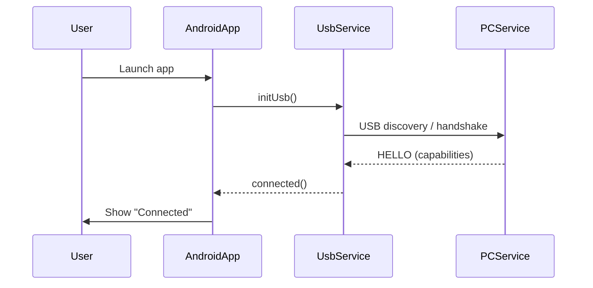
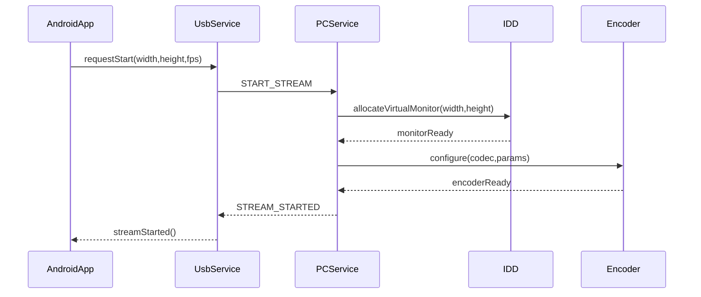
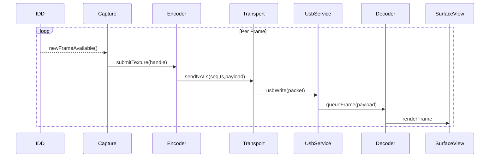
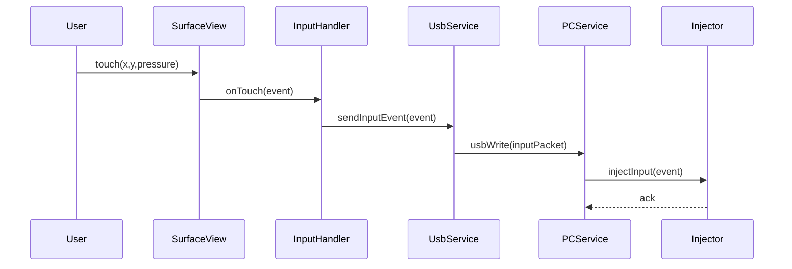
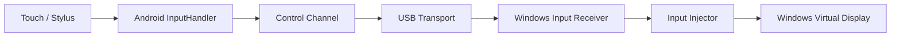
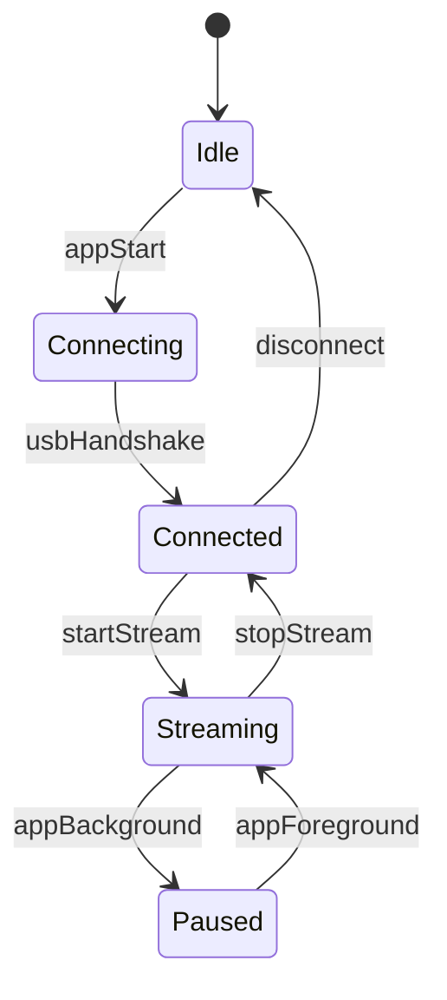
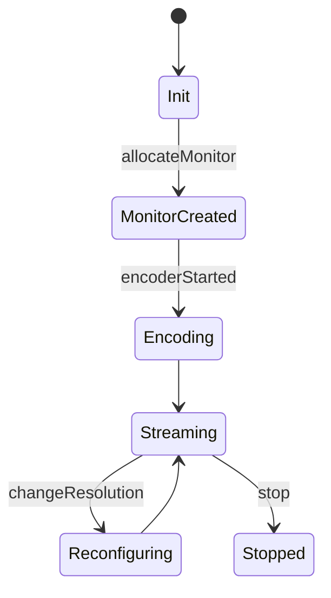
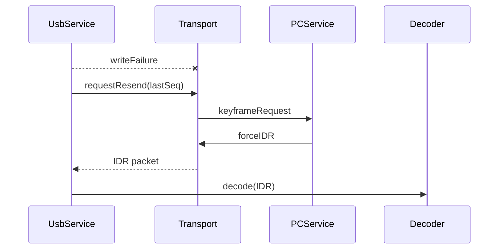

# Native-Java Second-Screen — Diagrams & Technical Specification

**Scope:** This document contains focused architecture and sequence diagrams (Mermaid) plus supporting notes for a **fully native Java Android receiver** and a **Windows sender** (IDD + encoder + USB transport). Use this as the engineering blueprint for implementation, testing, and handoff.

---

# 1. Executive summary

Build a true extended-display system where Windows presents a virtual monitor (Indirect Display Driver) and streams encoded frames to an Android device over **USB (MVP)**. Android runs a **pure Java** app using `MediaCodec` + `SurfaceView` and a native USB transport to receive frames and forward touch/pen input back to Windows. Later phases add Wi‑Fi/LAN (WebRTC/RTP).

---

# 2. High-level architecture

```mermaid
flowchart LR
    subgraph Windows
        IDD[Indirect Display Driver (IDD)]
        Capture[Capture Service (DXGI / Shared D3D)]
        Encoder[Hardware Encoder (NVENC / QSV / AMF)]
        Transport[Transport Service (WinUSB / USB Bulk)]
        InputInjector[Input Injector / HID]
        UI[Settings / Installer]
    end

    subgraph Android
        USB[UsbManager / Accessory]
        UsbService[UsbService (Java)]
        Decoder[VideoDecoder (MediaCodec)]
        Surface[SurfaceView]
        InputHandler[Touch & Stylus Handler]
        AppUI[App UI (Settings)]
    end

    IDD --> Capture
    Capture --> Encoder
    Encoder --> Transport
    Transport --> UsbService
    UsbService --> Decoder
    Decoder --> Surface
    Surface --> InputHandler
    InputHandler --> UsbService
    UsbService --> Transport
    UI --> Transport
    UI --> IDD
    AppUI -. controls .-> UsbService
```

---

# 3. Component diagrams

## 3.1 Windows components (detailed)

```mermaid
flowchart TB
    IDD[Indirect Display Driver]
    UserService[User-mode Capture & Transport Service]
    Capture[DXGI / Shared Texture Capture]
    Preproc[Pre-processing / Crop / Cursor]
    Encoder[NVENC / Media Foundation Encoder]
    Packetizer[Packetizer & Framing]
    USBWin[WinUSB Endpoint]
    InputSvc[Input Service (listener)]
    Injector[Windows Input Injector]

    IDD --> Capture
    Capture --> Preproc
    Preproc --> Encoder
    Encoder --> Packetizer
    Packetizer --> USBWin
    USBWin -->|USB Bulk| AndroidUSB
    AndroidUSB -.-> UsbService
    USBWin --> InputSvc
    InputSvc --> Injector
    Injector --> IDD
```

## 3.2 Android components (detailed)

```mermaid
flowchart TB
    UsbManager[Android UsbManager]
    UsbService[UsbService Thread]
    Parser[Frame & Control Parser]
    Decoder[VideoDecoder (MediaCodec)]
    SurfaceView[SurfaceView]
    Render[GPU Render]
    InputHandler[Touch / Stylus Handler]
    ControlOut[Control & Input Sender]

    UsbManager --> UsbService
    UsbService --> Parser
    Parser --> Decoder
    Decoder --> SurfaceView
    SurfaceView --> Render
    SurfaceView --> InputHandler
    InputHandler --> ControlOut
    ControlOut --> UsbService
```

---

# 4. Sequence diagrams

## 4.1 Pairing & Connection (USB)



## 4.2 Start Stream (handshake)



## 4.3 Frame capture → encode → decode loop



## 4.4 Input event loop (touch / pen)



---

# 5. Data flow diagrams

## 5.1 Video data flow

```mermaid
flowchart LR
    VM[Virtual Monitor GPU Texture]
    VM --> Capture[Capture Service (D3D Shared)]
    Capture --> Encoder[HW Encoder (NVENC/QSV/AMF)]
    Encoder --> Packetizer[Packetizer (NAL framing)]
    Packetizer --> USB[USB Bulk Transport]
    USB --> UsbService[Android UsbService]
    UsbService --> Decoder[MediaCodec]
    Decoder --> SurfaceView[SurfaceView Render]
```

## 5.2 Input data flow



---

# 6. State machines

## 6.1 Android connection state



## 6.2 PC streaming state



---

# 7. Failure & recovery flows



Notes:
- On packet loss or decode failure, Android should request an IDR (keyframe) from PC.
- Implement timeouts and reconnect logic: after N failed writes / reads, attempt re-enumeration.

---

# 8. Transport protocol (summary)

- **Message header**: `[uint8 type][uint32 length][uint64 ts][uint32 seq]` (little-endian)
  - `type`: 0x01=VideoFrame, 0x02=InputEvent, 0x03=Control
  - `length`: payload size
  - `ts`: timestamp in microseconds
  - `seq`: frame or packet sequence number
- **VideoFrame payload**: one or more concatenated NAL units (H.264/HEVC) with optional annex‑b if required.
- **InputEvent payload**: fixed struct `{uint8 evtType, uint8 pointerId, float xNorm, float yNorm, float pressure, uint32 flags}`
- **Control**: JSON or binary small commands (START_STREAM, STOP_STREAM, REQUEST_KEYFRAME, SET_PARAMS)
- **Transport**: USB Bulk endpoints (reliable). For Wi‑Fi/LAN later, use RTP/UDP or WebRTC.

---

# 9. Java class skeletons (Android)

```java
// MainActivity: sets up SurfaceView + lifecycle
public class MainActivity extends Activity {
  SurfaceView surfaceView;
  UsbService usbService;
  VideoDecoder decoder;
  InputHandler inputHandler;
}

// UsbService: manages accessory / bulk pipe, read/write threads
public class UsbService {
  void start();
  void stop();
  void writePacket(byte[] data);
  void setFrameListener(FrameListener l);
}

// VideoDecoder: wraps MediaCodec
public class VideoDecoder implements Runnable {
  void configure(int w,int h, Surface surface);
  void queueFrame(byte[] nal);
  void stop();
}

// InputHandler: converts MotionEvent -> input packets
public class InputHandler {
  byte[] buildInputPacket(MotionEvent e);
}
```

---

# 10. Performance targets & budget

- **End-to-end latency (goal)**: 40–100 ms (USB 1080p target) – aim for <100 ms for MVP.
- **Frame rate**: 30 FPS baseline; 60 FPS goal.
- **Encoder settings (initial)**: H.264, CBR, no B-frames, GOP=30, bitrate 6–12 Mbps for 1080p.
- **Buffers**: Minimal buffering (1–2 frame buffers on sender & receiver) to reduce latency.

Latency budget example:
```text
Capture: 2–6 ms
Encode: 5–12 ms (HW)
USB transfer: 1–4 ms
Decode: 4–10 ms
Render: 1–4 ms
Total: 13–36 ms (best-case) + scheduling/jitter -> realistic 40–100 ms
```

---

# 11. Roadmap & milestones

- **MVP (8–12 weeks)**: IDD skeleton; user-mode capture; NVENC prototype; WinUSB transport; Java Android app with MediaCodec + SurfaceView; input pipeline; end-to-end test.
- **Phase 2 (4–8 weeks)**: abstract transport, add Wi‑Fi/LAN (RTP/WebRTC), discovery, adaptive bitrate.
- **Phase 3 (ongoing)**: multi-monitor, pen tilt/pressure, driver signing & installer polishing, performance tuning to improve <50 ms.

---

# 12. Testing checklist

- IDD visible in Windows display settings.
- End-to-end frame numbering test (inject frame counters).
- Round-trip latency measurement (timestamp in frame header vs. input ack).
- Stress run: 6+ hours at 1080p/30fps.
- Pen pressure & multi-touch correctness.

---

# Appendix: rendering-safe Mermaid snippets

Use the provided Mermaid blocks (copy/paste) — they are validated for one-node-per-line syntax and should render in Mermaid Live Editor or Markdown renderers that support Mermaid.

*End of document.*

